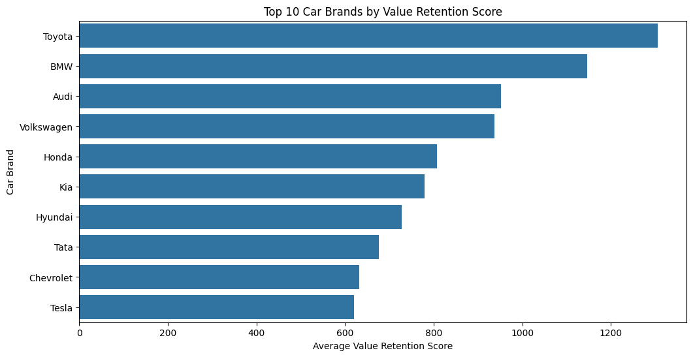
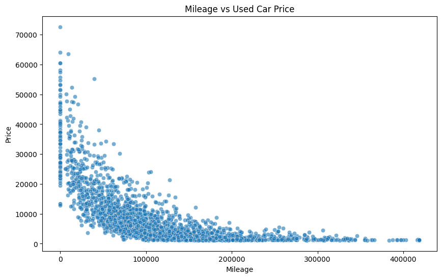
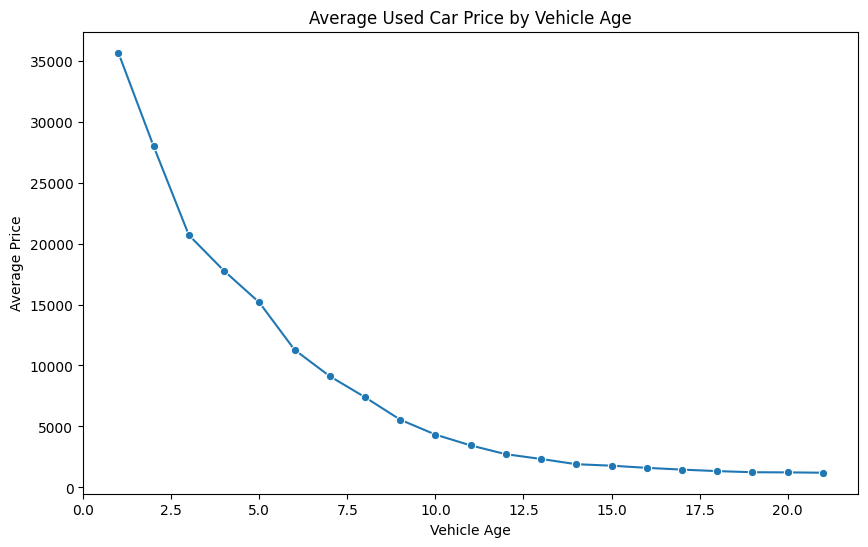
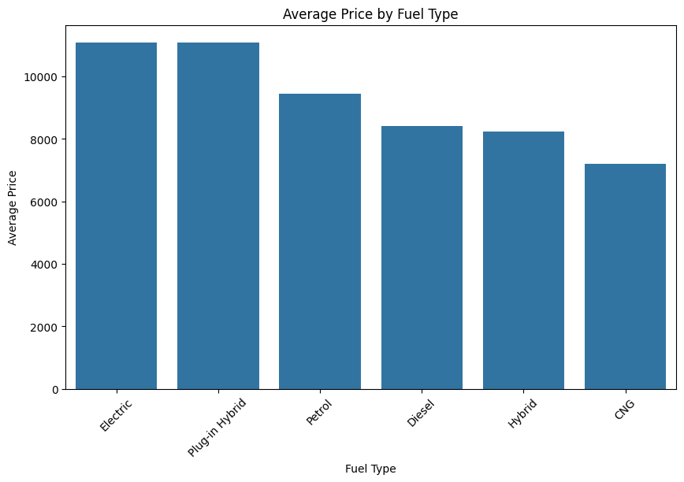
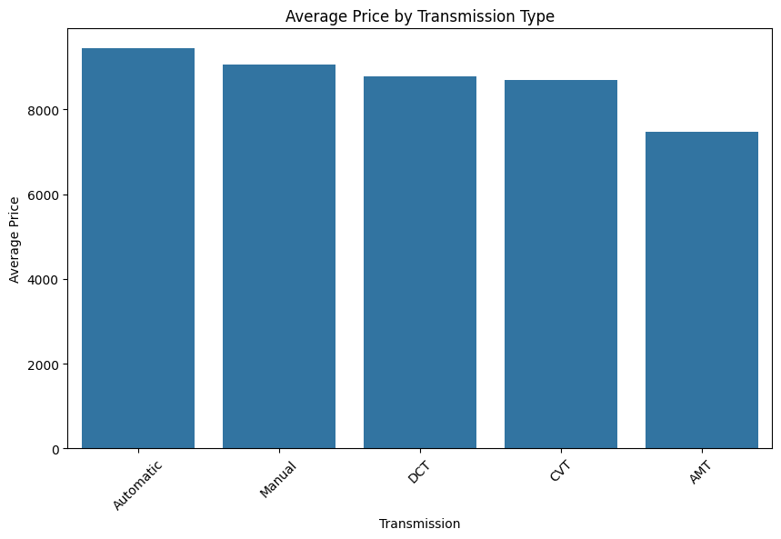
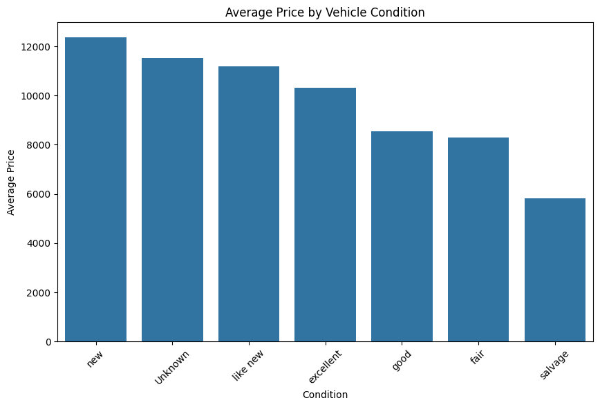

# Used Car Listings Analysis

## Project Objective

The objective of this project is to analyze the global used car market and identify which car brands retain their value over time. This project examines factors that may contribute to depreciation, including mileage, vehicle age, fuel type, transmission, condition, brand, and location.

The goal of this analysis is to uncover patterns that influence used car resale value. These findings can help buyers identify vehicles that hold their value well and help sellers or dealers price vehicles more competitively.

## Dataset

This project uses a used car listings dataset that contains vehicle information such as price, mileage, brand, model, fuel type, transmission, condition, and location.

- CSV file: [used_car_listings.csv](used_car_listings.csv)
- JSON file: [used_car_listings.json](used_car_listings.json)

## Tools and Technologies

The project uses multiple tools and technologies to clean, analyze, visualize, and model the used car listings data:

- **Google Colab** for developing and running the Python notebook in a cloud-based environment
- **Python** for data cleaning, analysis, visualization, and machine learning
- **Pandas** for data cleaning, preprocessing, and data transformation
- **Matplotlib and Seaborn** for exploratory data visualizations
- **Scikit-learn** for building and evaluating machine learning models
- **R** for additional used car value analysis
- **Plotly Dash** for developing the interactive dashboard
- **CodePen** for creating a basic web-based Price vs Mileage visualization
- **GitHub** for project documentation, file storage, and version control

## Google Colab Notebook

This project includes a Google Colab notebook that contains the full data cleaning, exploratory data analysis, and machine learning process for the used car listings dataset.

The notebook includes:

- Data loading and Google Colab setup
- Data cleaning and preprocessing
- Missing value and duplicate checks
- Feature creation, including vehicle age and value retention score
- Exploratory data analysis for used car pricing trends
- Visualizations for mileage, vehicle age, brand value retention, fuel type, transmission, and condition
- Machine learning models to predict used car prices
- Model comparison using Linear Regression and Random Forest Regressor

Notebook Link: [Used Car Listings Analysis Notebook](notebooks/Used_Car_Listings_Analysis.ipynb)

## R Analysis

The R portion of the project focuses on analyzing used car value and identifying factors that affect resale prices.

- [Used Car Value Determination R Script](assignment3.R)

## Price vs Mileage Visualization

A Price vs Mileage bar graph was created using CodePen to explore the relationship between vehicle mileage and listing price.

- [Price vs Mileage Folder](https://github.com/simmonnguyen/Used-Car-Listings/tree/main/Price%20vs%20Mileage%20Codepen)
- [Price vs Mileage CodePen](https://codepen.io/simmonnguyen/pen/NPxpNwQ)

## Interactive Dashboard

An interactive dashboard was created using Plotly Dash to allow users to explore the used car listings dataset visually.

Dashboard features include:

- Filtering used car listings by country
- Comparing vehicle prices by brand
- Analyzing price trends based on mileage
- Exploring depreciation patterns across different vehicle attributes
- Viewing interactive charts and graphs

- [Used Car Listings Dashboard](https://7f7a3de9-5715-44ce-9da6-6385ce8cac2b.plotly.app/)

## Key Questions Explored

This project focuses on answering questions such as:

1. Which car brands retain their value the best?
2. How does mileage affect used car price?
3. How does vehicle age contribute to depreciation?
4. Do fuel type, transmission, or condition impact resale value?
5. How do used car prices vary by location?

## Key Findings

The notebook explored several questions related to used car resale value, depreciation, and pricing trends. Each question was analyzed using cleaned vehicle listing data and visualized with charts from the notebook.

### 1. Which car brands retain their value the best?

This analysis compared car brands using a value retention score based on price, mileage, and vehicle age. Brands with higher value retention scores tend to keep stronger resale value compared to other brands in the dataset.

**Finding:**  
The results show that certain car brands retain their value better than others. These brands may have stronger resale demand, better reliability reputation, or lower depreciation compared to brands with lower value retention scores.

---

### 2. How does mileage affect used car price?

This analysis examined the relationship between mileage and used car price. Mileage is one of the most important factors in used car pricing because higher mileage usually means more wear and tear on the vehicle.

**Finding:**  
The graph shows that vehicles with lower mileage generally have higher prices, while vehicles with higher mileage tend to have lower prices. This suggests that mileage has a negative relationship with used car price.

---

### 3. How does vehicle age contribute to depreciation?

This analysis looked at how the age of a vehicle affects its average resale price. Vehicle age was calculated by subtracting the car’s model year from the current year.

**Finding:**  
The results show that older vehicles generally have lower average prices. This supports the idea that vehicles depreciate over time as they age, even when other factors such as mileage and condition may also play a role.

---

### 4. Do fuel type, transmission, or condition impact resale value?

This analysis compared average used car prices across fuel type, transmission type, and vehicle condition. These features can affect resale value because buyers may prefer certain vehicle types depending on reliability, fuel efficiency, driving experience, and overall condition.

**Finding:**  
The results show that vehicle characteristics such as fuel type, transmission, and condition can influence used car prices. Cars in better condition usually have higher resale values, while certain fuel or transmission types may also be associated with higher average prices depending on buyer demand.

## Conclusion

This project provides an overview of the used car market by analyzing important vehicle attributes that influence resale value. Through R analysis, web-based visualizations, and an interactive Plotly Dash dashboard, users can explore how mileage, brand, age, condition, and location affect used car prices.

